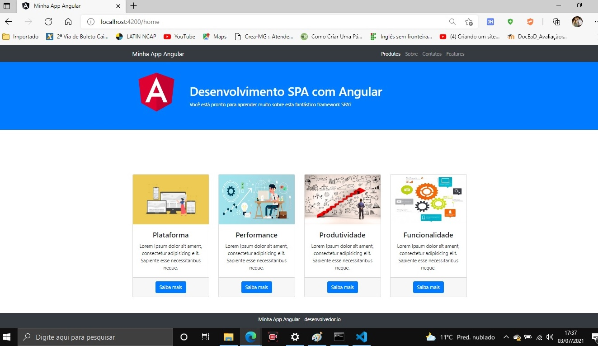
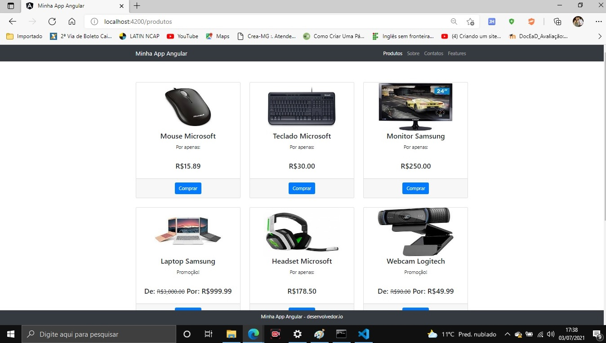
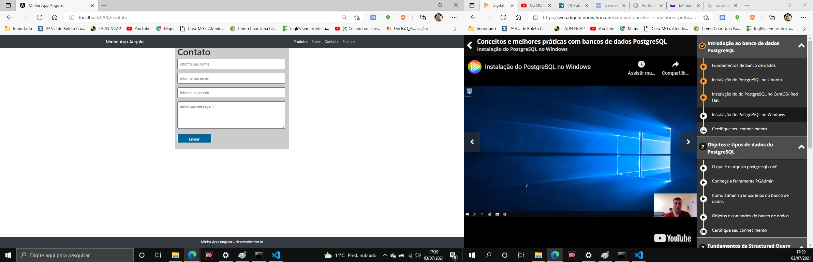

  <a href="#-projeto">Projeto</a>&nbsp;&nbsp;&nbsp;|&nbsp;&nbsp;&nbsp;
  <a href="#-tecnologias">Tecnologias</a>&nbsp;&nbsp;&nbsp;|&nbsp;&nbsp;&nbsp;
  <a href="#-layout">Layout</a>&nbsp;&nbsp;&nbsp;|&nbsp;&nbsp;&nbsp;

 

  

# 💻 Projeto:
This project was generated with [Angular CLI](https://github.com/angular/angular-cli) version 12.0.1.

## 🚀 Tecnologias:

Esse projeto foi desenvolvido usando as seguintes tecnologias:

- HTML
- CSS
- JAVASCRIT
- Angular

## Development server

Run `ng serve` for a dev server. Navigate to `http://localhost:4200/`. The app will automatically reload if you change any of the source files.

## Getting started
Install JSON Server

npm install -g json-server
Create a produtos.json file with some data

{
    "produtos": 
    [
        { "id": 1, "nome": "mouse microsoft", "Valor": 15.89, "promocao": false, "valorPromo": 0, "imagem": "mouse.jpg" },
        
        { "id": 2, "nome": "Teclado microsoft", "Valor": 30.00, "promocao": false, "valorPromo": 0, "imagem": "teclado.jpg" }
    ]}

Start JSON Server

json-server --watch db.json

